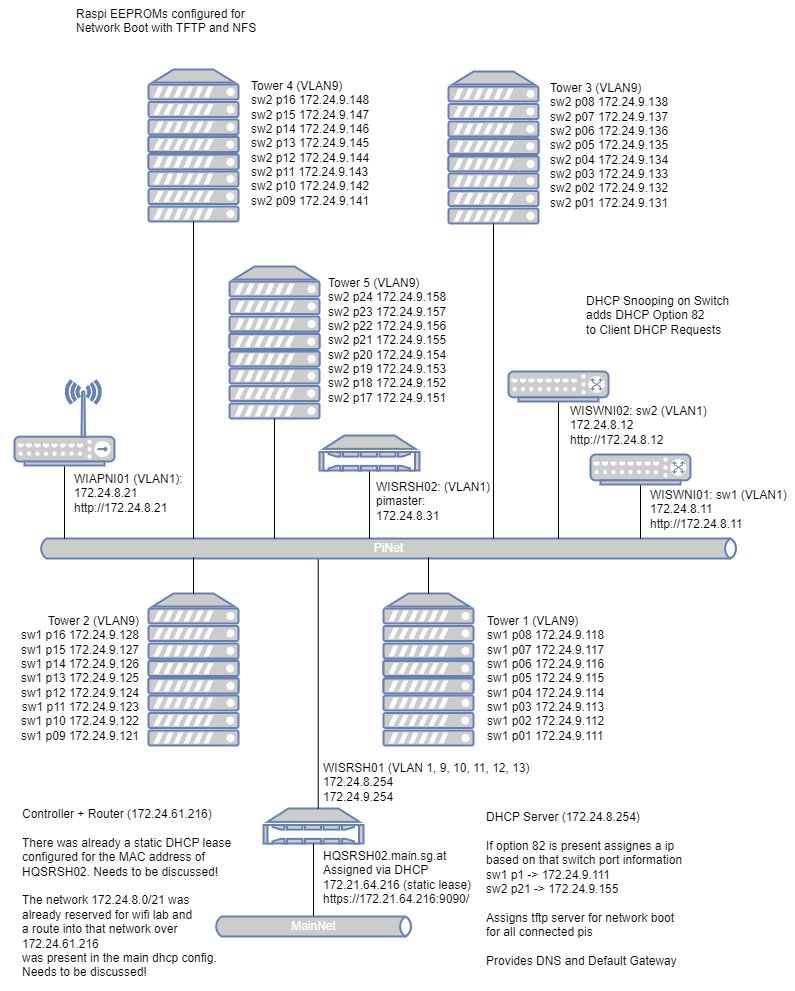

#  PingUI

**PingUI** is a GUI (Graphical User Interface), made for the visualization but also managing of log data collected by a program called pictl. 

Development will start on the _1st of July, 2024_.

## Current State

The pi rack consists of five towers filled with 8 pi nodes each. Those pi nodes are each equipped with 5 wifi cards and connected via ethernet to the pi net. (see raspirack.png for details on the networking). The end goal is to use those 40 pi nodes (200 wifi cards) to stress test access points we develop in real-world scenarios.
  
To make the pi nodes act in unison and coordinated a tool called pictl was already created. This tool in tandem with a dhcp, dns, tftp and nfs server is used to manage all the pi nodes (network boot with nfs root fs).  
pictl can be used to execute scripts on running pi nodes and get the logs back.
  
For example, one such script could contain the directives to connect to a certain accesspoint ssid, download a file and log the download statistics.
Using pictl this script is then launched on all 40 pi nodes five times (once for each wifi card). This makes 200 concurrent executions of this one script.
pictl would then show all the logs in its standard output at once (and also write them to files).
  
As one can imagine, this way too much output to effectively analyze at a glance. 

### Watered down to max 400 characters (English)

The company SecureGuard currently tests access points, which they develop.
For this matter they have five towers filled with 8 pi nodes each and they created a tool called Pictl.
Pictl manages the pi nodes and is able to make them execute scripts.
The results, which are the logs of the specific scripts, are all shown in raw format and all at once.

### German

Das Unternehmen SecureGuard testet derzeit Accesspoints, die sie selbst entwickeln.

Zu diesem Zweck haben sie fünf Türme mit jeweils 8 Pi-Nodes aufgebaut und ein Tool namens Pictl entwickelt. Pictl verwaltet die Pi-Nodes und kann sie dazu bringen Skripte auszuführen.

Die Ergebnisse, d.h. die Logs der einzelnen Skripte, werden alle im Rohformat und auf einmal angezeigt.

## Investigation Concern of the individual topics

### English Version

#### Yannik Lisa

1. Research which real time database is easy to work with

2. Examine which format is useful to deliver the data to the frontend.

3. Research how the pictl-tool and the database should interact with each other

4. Analyse which algorithms are the most effective to parse a large amount of data in real time.

#### Mattias Wolfslehner

1. Examine what a user-friendly UI for the application should look like

2. Evaluate which framework works best for creating such an interface

3. Check the compatibility of the framework with diagram graphics

### German Version

#### Yannik Lisa

1. Recherchieren, ob eine Echtzeitdatenbank geeignet für das Projekt ist.

2. Untersuchen, welches Format sinnvoll ist, um die Daten an das Frontend zu liefern.

3. Recherchieren, wie das pictl-tool und die Datenbank miteinander interagieren sollen

4. Analysieren, welche Algorithmen am effektivsten sind, um eine große Datenmenge in Echtzeit zu parsen.

#### Mattias Wolfslehner

1. Untersuchen, wie ein benutzerfreundliches UI für die Anwendung aussehen sollte

2. Evaluieren, welches Framework am besten für die Erstellung eines solchen Frontends geeignet ist.

3. Prüfen der Kompatibilität des Frameworks mit Diagrammgrafiken

## Target-Situation

### English Version

A web **frontend** and **backend** is needed, that manages pictl script executions, parses the output and then displays the output in real time in different ways depending on what type of tests the script executes.
  
There are load tests (display current speed per node), stability tests (display connection status per node) and more specific tests, which just have to have their logs displayed in real time as they are executed.

### German Version

Es wird ein Web-Frontend und -Backend benötigt, das die Ausführung von Pictl-Skripten verwaltet, die Ausgabe analysiert und sie dann in Echtzeit auf unterschiedliche Weise anzeigt, je nachdem, welche Art von Tests das Skript ausführt. 
Es gibt Lasttests, Stabilitätstests und spezifischere Tests, deren Protokolle (Logs) in Echtzeit angezeigt werden müssen, während sie ausgeführt werden.

## Planned result of the individual topics

### English Version

- No expected costs

#### Yannik Lisa

- Interaction of app to pictl

- Modelling of a database to store the pictl data

- Analysis of past script results for trends or anomalies **in diagram form**

#### Mattias Wolfslehner

- Creation of a detailed wireframe created with Figma

- Implementation of the graphical depiction with data from the backend

### German Version

- Keine Kosten zu erwarten

#### Yannik Lisa

- Interaktion von App zu Pictl

- Modellierung einer Datenbank zur Speicherung der pictl-Daten

- Analyse vergangener Skriptergebnisse auf Trends oder Anomalien **in Diagrammform**

#### Mattias Wolfslehner

- Erstellung eines detaillierten Wireframes, erstellt mit Figma

- Implementierung der grafischen Darstellung mit Daten aus dem Backend

## Milestones

4 Weeks; 20 Days with each 9h; 180h --> 30h per milestone

1. Planing finished with a meaningful wireframe for the webapplication

   - **01.07** -> time before start of project
       

2. The application is able to execute scripts with the pictl tool

   - **09.07** -> 7 days
       

3. The first results can be presented in a limited format

   - **17.07** -> 6 days
       

4. The amount of pictl results shown can be customized and the full response is availabe if wished

   - **20.07** -> 3 days
       

5. The results are saved and stored according to the given script

   - **24.07** -> 3 days
       

6. The system analyses and parses the data into the right format and the UI shows this information in a x-y Diagram

   - **26.07** -> 2 days

## Individual topics of the candidates

_Look [Investigation concern of the individual topics](#investigation-concern-of-the-individual-topics)_

<u>Workload:</u> _~180 hours_

## Thesis Cooperation

This diploma project is made in cooperation with **secureGuard**, an IT-Company in Linz. The impressum states as follows:

<u>Company name:</u> _Kontron Technologies GmbH BU secureguard_

<u>Address:</u> _Industriezeile 35, A-4020 Linz, Austria_

<u>E-Mail:</u> _office@secureguard.at_

<u>Company register number:</u> _FN55667_

<u>Commercial register court:</u> _Linz Regional Court (Landesgericht Linz)_

<u>Authority according to ECL (ger. ECG):</u> _Municipality of the City of Linz/Danube_

<u>VAT-Number:</u> _ATU66143345_

And our project supervisor and contact inside the company is **Mr Gerald Degeneve**, the head of the development branch.

---

For more information look <a href="https://www.secureguard.at/impressum/">here</a>.

### Legal regulations

It was verbally agreed that both code and results may be demonstrated to the professors. All potentially company-critical data and images will be made unrecognisable when incorporated into the thesis.
